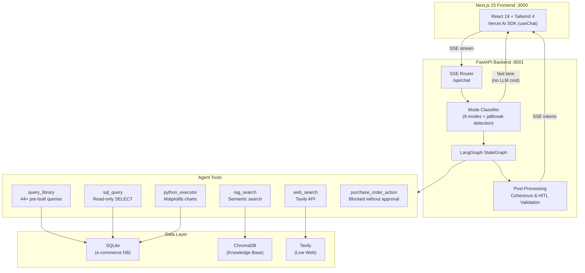
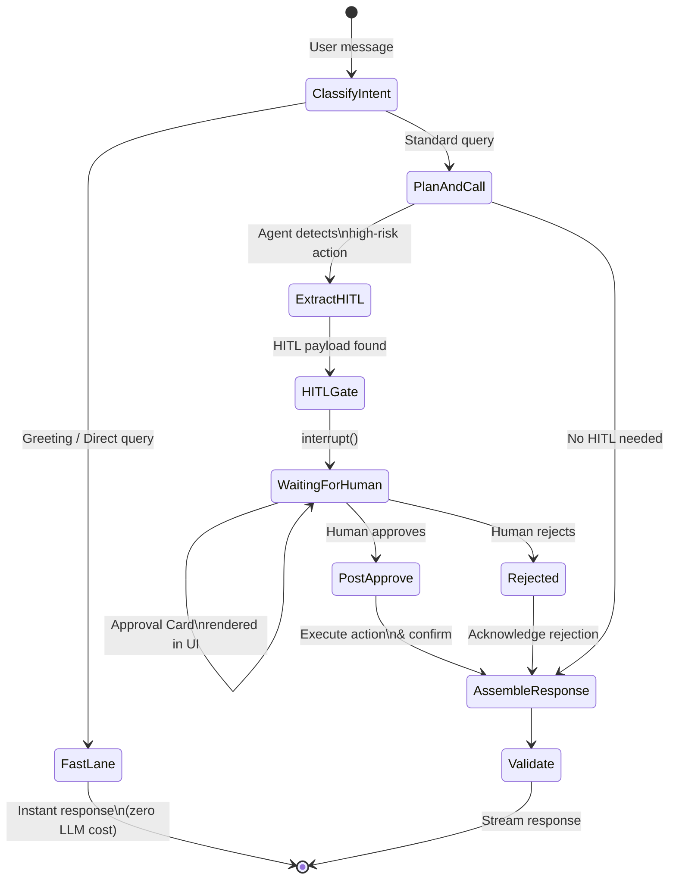

# AgenticStack: Enterprise-Grade AI E-commerce Assistant

**A production-ready demonstrator for safe, cost-controlled agentic AI in business environments.**

AgenticStack is a full-stack AI assistant that combines autonomous decision-making with strict enterprise guardrails. It queries databases, searches internal knowledge bases, browses the web, generates charts — and **always asks a human before taking high-risk actions**. Built to show that agentic AI can be deployed responsibly in customer-facing and back-office workflows.

[](https://nextjs.org/)
[](https://fastapi.tiangolo.com/)
[](https://langchain-ai.github.io/langgraph/)
[](https://openai.com/)
[](https://docs.docker.com/compose/)
[](LICENSE)

---

## Architecture



## Human-in-the-Loop Workflow

High-risk actions (refund emails, promotion strategies, purchase orders) are **never executed autonomously**. The agent detects intent, pauses execution, and surfaces an approval card to the human operator.



---

## Key Business Features

### Cost Control
- **Global rate limit** (100 messages/day) and **per-user rate limit** (10 messages/day) protect API spend on public demos.
- **Admin bypass** via secret token for unrestricted access during client demonstrations.
- **Fast lanes** — regex-based routing handles greetings, direct queries, chart requests, and off-topic messages **without invoking the LLM**, reducing latency and cost to near-zero for common interactions.
- **Result caching** with 60-second TTL on SQL queries avoids redundant database and LLM calls.

### Data Privacy & Ephemeral Sessions
- **Per-tab session isolation** — each browser tab gets a unique `sessionStorage` UUID. Closing the tab erases the session context.
- **Automated garbage collection** — conversations with no active session are purged within 24 hours.
- **Read-only SQL enforcement** — the AI agent can only execute `SELECT` statements against the e-commerce database. Write operations are restricted to explicitly approved workflows (purchase orders).

### Human-in-the-Loop (HITL) Approval
- **3-layer enforcement**: LangGraph `interrupt()`, tool-level intent guards, and system prompt rules ensure high-risk actions cannot bypass approval.
- **3 built-in use cases**: Refund Emails, Promotion Strategies, Purchase Order lifecycle (Draft → Approved → Sent → Received).
- **Full audit trail** — every approval decision is traced and persisted.

### Security
- **2-layer prompt injection defense**: regex-based jailbreak detection in the classifier (no LLM exposure) + LLM-level security instructions for novel bypass attempts.
- **Structured logging** with `X-Request-ID` tracing across the full request lifecycle.
- **Trace Inspector** — every agent response includes a full execution trace (node flow, tool calls, LLM interactions, timing) accessible via UI or API.

---

## Technical Stack

| Layer | Technology |
|-------|-----------|
| **Frontend** | Next.js 15 (App Router), React 19, Tailwind CSS 4, Vercel AI SDK (`useChat`) |
| **Backend** | Python 3.11+, FastAPI, SSE streaming, structlog |
| **Agent** | LangGraph StateGraph, explicit node/edge graph (not ReAct), GPT-4o-mini |
| **Database** | SQLite (WAL mode, async via aiosqlite), Prisma-generated schema |
| **Knowledge Base** | ChromaDB with `text-embedding-3-small`, 11 Markdown documents |
| **Web Search** | Tavily API (max 5 results per query) |
| **Charts** | Matplotlib via sandboxed Python subprocess (30s timeout) |
| **Infra** | Docker Compose, named volumes for DB/ChromaDB/charts persistence |

---

## Quick Start

### Prerequisites

- **Docker** and **Docker Compose**
- API keys: `OPENAI_API_KEY`, `TAVILY_API_KEY`

### 1. Configure environment

Create a `.env` file at the project root:

```env
OPENAI_API_KEY=sk-...
TAVILY_API_KEY=tvly-...
ADMIN_SECRET_TOKEN=your-admin-token    # optional, for rate-limit bypass
```

### 2. Launch the stack

```bash
docker-compose up -d
```

This starts:
- **Frontend** at [http://localhost:3000](http://localhost:3000)
- **Backend** at [http://localhost:8001](http://localhost:8001)

### 3. Ingest the knowledge base (first run only)

```bash
docker-compose exec backend python -m rag.ingest
```

### Local Development (without Docker)

```bash
# Backend (port 8001)
cd agent && python -m rag.ingest                    # one-time RAG ingestion
"agent/.venv/Scripts/uvicorn.exe" backend.main:app --host 127.0.0.1 --port 8001

# Frontend (port 3000)
npm install && npm run dev
```

---

## Agent Tools

| Tool | Purpose | Cost |
|------|---------|------|
| `query_library` | 44+ pre-built SQL queries by name — **preferred** over raw SQL | No LLM |
| `sql_query` | Read-only `SELECT` (max 100 rows) when no library query fits | No LLM |
| `rag_search` | Semantic search over internal knowledge base (top-5 chunks) | Embedding |
| `web_search` | Live web search via Tavily (max 5 results) | API call |
| `python_executor` | Sandboxed Python with Matplotlib chart generation (30s timeout) | No LLM |
| `purchase_order_action` | PO lifecycle management — **blocked unless HITL-approved** | No LLM |

---

## Project Structure

```
src/                    Next.js frontend (App Router)
  app/
    chat/[id]/          Conversation page (SSR)
    database/           Database Explorer tab
    documents/          Knowledge Base tab (Markdown + PDF)
    api/                Route handlers (chat, conversations, charts)
  components/           UI components (ChatArea, MessageBubble, TracePanel, HITL cards)

backend/                FastAPI backend
  graph/                LangGraph StateGraph (state, nodes, edges, builder, stream)
  core/                 System prompt + per-mode templates
  tools/                6 agent tools
  routers/              API endpoints
  queries/library.py    44+ named SQL queries
  rag/                  ChromaDB ingestion + retrieval

docs/                   RAG knowledge base (11 Markdown files)
dev.db                  SQLite database (Prisma schema)
docker-compose.yml      One-command deployment
```

---

## License

MIT

---

<p align="center">
  Built by <strong>Matthieu Restellini</strong> — AI & Full-Stack Engineering
</p>
